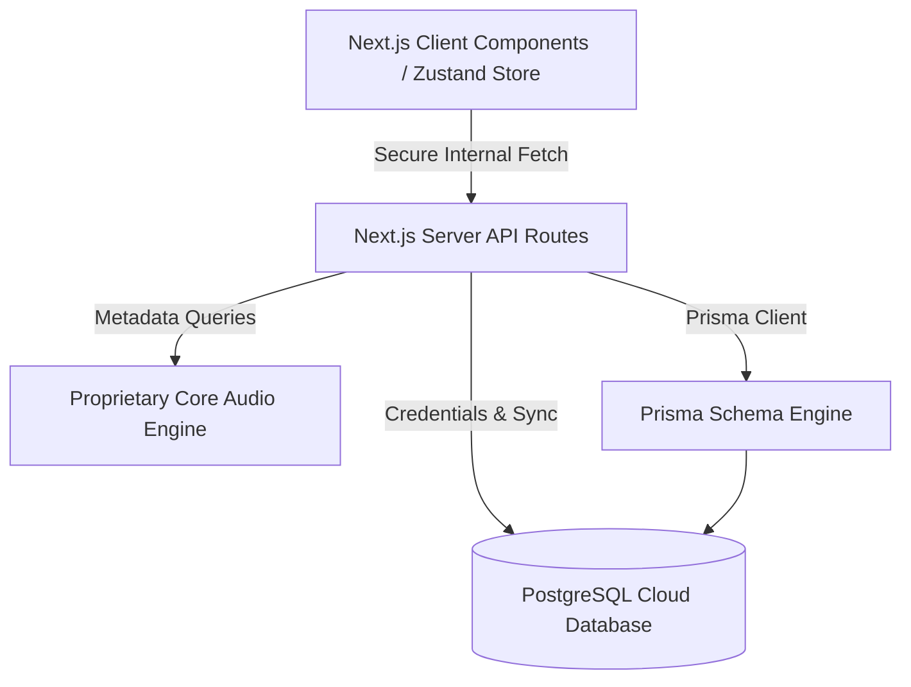

# Tunely 🎵

[](https://nextjs.org/)
[](https://www.typescriptlang.org/)
[](https://tailwindcss.com/)
[](https://www.prisma.io/)
[](https://www.postgresql.org/)

Tunely is a premium, high-fidelity music streaming application engineered to deliver an immersive and cinematic listening experience directly in the browser. Designed with cutting-edge front-end aesthetics, a custom audio playback engine, and seamless cloud database synchronization, Tunely sets a new standard for web-based music players.

Created & Developed by **Shivam Kothekar**.

---

## ✨ Features Showcase

### 🎨 Premium UI/UX & Glassmorphic Design
- **Cinematic Dark Mode:** Crafted with deep, tailored HSL color palettes, vibrant gradients, and elegant dark-mode glassmorphic layouts.
- **Micro-Animations:** Fluid, interactive transitions, hover effects, and active state indicators that make the platform feel alive.
- **Adaptive Ambient Glow:** Dynamic color matching that shifts subtle backdrops based on the currently playing track's artwork.
- **Responsive Mobile Layout:** Reimagned from the ground up for mobile screens, featuring an ergonomic bottom navigation system, edge-to-edge container margins, and simplified swipe controls.

### 🎧 Custom Audio Engine & Queue Management
- **Persistent Player:** Seamless, uninterrupted playback across page transitions.
- **Dynamic Queue Control:** Full capability to add to queue, play next, reorder, and clear tracks.
- **Advanced Controls:** Core integrations for shuffle, repeat (all/single), and precise volume slider adjustments.
- **Lazy Loading & Bitrate Optimization:** Automatic audio stream loading with maximum audio quality and zero buffer delays.

### 📝 Real-Time Synced Lyrics
- **Precision Timings:** Real-time, line-by-line highlight rendering synchronized perfectly with the playback timestamp.
- **Lyric Sharing System:** Generate beautiful, shareable lyrics cards with single-click functionality.
- **Smart Fallback Engine:** Multi-source parallel indexing engine that retrieves lyrics immediately with automatic plain-text fallbacks if synchronized files are unavailable.

### 📁 Personalized Space & Database Cloud Sync
- **Custom Playlists:** Design, curate, and update personal playlists on the fly.
- **Smart Library & Likes:** Save tracks to your library with instant client state response times, backed by server-side PostgreSQL permanence.
- **Recently Played History:** Automatically tracks and caches your listening history.
- **NextAuth Secure Sessions:** Built-in secure user profile storage and customizable authentication portal.

---

## 🏗️ Architecture & Core Engineering



### 🔒 Enterprise-Grade Security
- **Secure Proxies:** All communication with core indexing nodes goes through internal Next.js `/api/*` endpoints, keeping actual stream server origins completely confidential.
- **Encrypted Sign-in:** Standard cryptographical hashing algorithms protect credentials, with strict secure TLS connections to the primary PostgreSQL data layers.
- **Environment Isolation:** Zero public exposure of backend tokens, secrets, or internal service endpoints.

---

## 🚀 Quick Local Development Setup

If you want to run this project locally, configure a standard web server node:

### 1. Installation
Clone this repository and install all dependencies:
```bash
git clone https://github.com/ShivamSk07/Tunely.git
cd Tunely
npm install
```

### 2. Configure Local Database
Set up a standard SQL database and generate your Prisma schema models:
```bash
npx prisma generate
npx prisma db push
```

### 3. Environment Setup
Create a `.env` file at the root, referencing the structure defined in `.env.example`:
```env
DATABASE_URL="your_secure_postgresql_connection_string"
NEXTAUTH_SECRET="your_custom_nextauth_signing_secret"
NEXTAUTH_URL="http://localhost:3000"
MUSIC_API_URL="your_music_indexing_endpoint"
NEXT_PUBLIC_APP_URL="http://localhost:3000"
```

### 4. Run Development Server
```bash
npm run dev
```

---

## 📃 License

Distributed under the MIT License. See `LICENSE` for more information.
